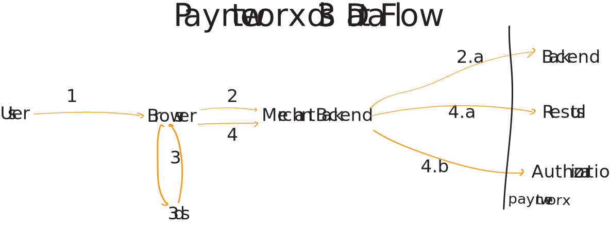

# Paynetworx 3ds 


##  Overview

## Setup

### Depedencies
1. bun [install](https://bun.sh/docs/installation)
2. download msignia usdk script and put into dist folder. talk to your paynetworx rep to get this script

### Running the demo
PLEASE NOTE: this is for demo purposes only, do not run real live cards through this systems. Also the code does not have all error handling and features a full production setup would need
1. copy config.example.json to config.json and edit file with credentials and urls: your paynetworx rep can provide these for you. 
2. start server
```bash
npm run serve
```
3. start bundler
```bash
npm run watch
```
4. go to localhost:8080

### Phase 1: Webpage
On the merchants webpage the customer will input their data. The  web page will also need to include the msignia usdk script (provided by paynetworx)

### Phase 2: Upload Data
Browser will need to atleast send the card PAN to the merchant backend to forward to paynetworx PSP frontent

### Phase 2.a: Upload Data
post to https://<paynetworx psp fronent>/upload with the following body
```json
{
    "acctId":"unique id for the transaction",
    "acctNumber" :"card PAN"
}
```
and Authorization header (same header and credentials you use for authorizing transactions).

Response: 

```json
{
    "TransactionDetailUrl":"url to pass to 3ds, valid for 1hr",
    "TransactionResultUrl":"url to pass to 3ds, valid for 1hr",
    "ResultsUrl":"url to retrieve results after 3ds authenication, valid for 1hr",
    "AuthToken":"unique token to be used to authenticate to 3ds, valid for 1hr"
}
```
those data  elements will need to be returned to the browser to use in the 3ds authentication flow


### Phase 3: Merchant Web Page, 3ds Authentication flow
1. load uSDK script into browser (uSDK-browser-7.3.37.js) provided by paynetworx
2. follow instructions [here](https://docs.msignia.com/7.X/usdk-docs/the-flow#callout-1---the-authenticate-method) to begin 3ds auth flow. Pass the the following values from previous step into the AuthenticateSpec
    a. TransactionDetailUrl -> exchangeTransactionDetailsUrl
    b. TransactionResultUrl -> transactionResultUrl
    c. AuthToken -> merchantAuthInfo

### Phase 4: Complete Transaction
browser sends the  rest of the payment information to the merchant backend.

### Phase 4.a: Retrieve Results
call get on ResultsUrl from phase 1 to get results of 3ds auth, response will look like:

```json
{ 
    "threeDSServerTransID":"...",
    "dsTransID":"...",
    "acsTransID":"...",
    "splitSdkServerTransId":"id to be passed to phase 4",
    "transStatus":"Y or N",
    "authenticationValue":"base64 value to be passed to phase 4",
    "eci":"number to be passed to phase 4"
}
```


### Phase 4.b: Retrieve Results
send transaction to paynetworx auth endpoing with the additional 3ds data from phase 4.a. For details on this message can be found [here](https://payment-api-docs.paynetworx.com/) example
 
```json
 {
    "Amount": {
      "Total": "12.00",
      "Tax": 0.25,
      "Currency": "USD"
    },
    "PaymentMethod": {
      "Card": {
          "CVC": {
              "CVC": "212"
          },
          "CardPresent": true,
          "PAN": {
              "PAN": "**********",
              "ExpMonth": "00",
              "ExpYear": "00"
          },
          "3DSecure":{
                "AuthenticationValue":"authenticationValue from phase 3",
                "ECommerceIndicator": "eci from phase 4",
                "3DSecureTransactionID":"splitSdkServerTransId  from phase 3"
          }
      }
    },
    "POS": {
      "EntryMode": "manual",
      "Type": "ecommerce",
      "Device": "Fake test JSON",
      "DeviceVersion": "0.0",
      "Application": "PaynetworxTest",
      "ApplicationVersion": "0.0",
      "Timestamp": "2020-03-03T17:01:44"
    }
  }
```


